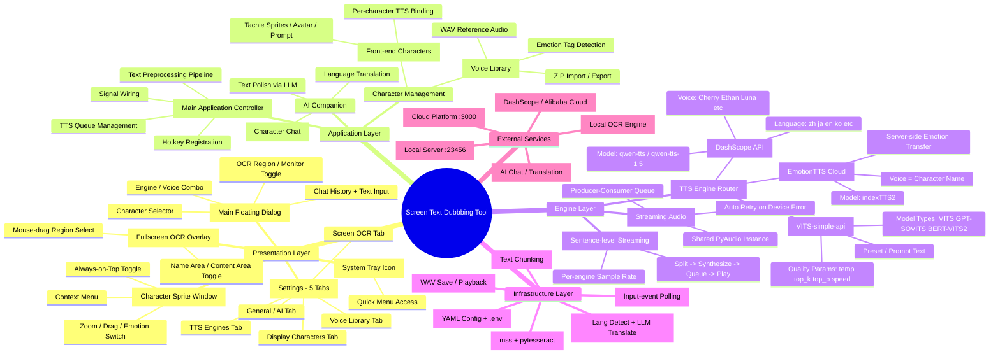
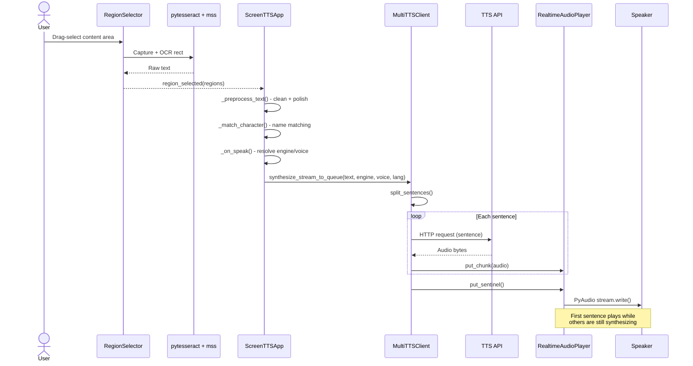
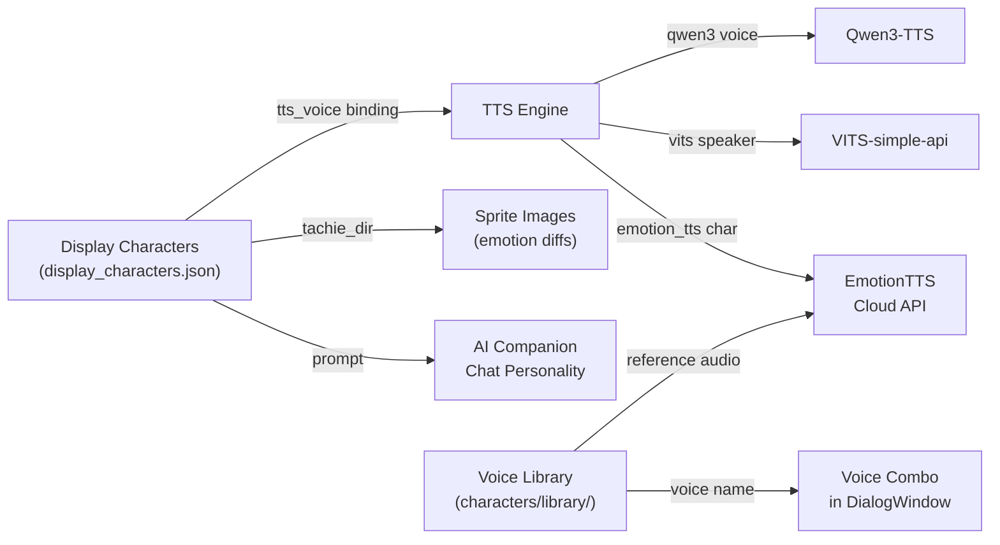

# Screen TExt Dubbing Tool - Knowledge Graph

## Architecture Knowledge Graph

```mermaid
mindmap
  root((Screen Text Dubbbing Tool))
    Presentation Layer
      TachieWindow[Character Sprite Window]
        Zoom / Drag / Emotion Switch
        Always-on-Top Toggle
        Context Menu
      DialogWindow[Main Floating Dialog]
        Character Selector
        Engine / Voice Combo
        Chat History + Text Input
        OCR Region / Monitor Toggle
      SettingWindow[Settings - 5 Tabs]
        Display Characters Tab
        Voice Library Tab
        TTS Engines Tab
        Screen OCR Tab
        General / AI Tab
      RegionSelector[Fullscreen OCR Overlay]
        Mouse-drag Region Select
        Name Area / Content Area Toggle
      SystemTray[System Tray Icon]
        Quick Menu Access
    Application Layer
      ScreenTTSApp[Main Application Controller]
        Signal Wiring
        Hotkey Registration
        TTS Queue Management
        Text Preprocessing Pipeline
      Character Management
        DisplayCharacterManager[Front-end Characters]
          Tachie Sprites / Avatar / Prompt
          Per-character TTS Binding
        CharacterManager[Voice Library]
          ZIP Import / Export
          WAV Reference Audio
          Emotion Tag Detection
      AI Companion
        chat_with_character[Character Chat]
        Text Polish via LLM
        Language Translation
    Engine Layer
      MultiTTSClient[TTS Engine Router]
        Qwen3TTSEngine[DashScope API]
          Voice: Cherry Ethan Luna etc
          Language: zh ja en ko etc
          Model: qwen-tts / qwen-tts-1.5
        VITSEngine[VITS-simple-api]
          Model Types: VITS GPT-SOVITS BERT-VITS2
          Preset / Prompt Text
          Quality Params: temp top_k top_p speed
        EmotionTTSEngine[EmotionTTS Cloud]
          Model: indexTTS2
          Voice = Character Name
          Server-side Emotion Transfer
      RealtimeAudioPlayer[Streaming Audio]
        Producer-Consumer Queue
        Shared PyAudio Instance
        Auto Retry on Device Error
      StreamingTTS[Sentence-level Streaming]
        Split -> Synthesize -> Queue -> Play
        Per-engine Sample Rate
    Infrastructure Layer
      ConfigManager[YAML Config + .env]
      AudioManager[WAV Save / Playback]
      OCRMonitor[Input-event Polling]
      ScreenCapture[mss + pytesseract]
      Translator[Lang Detect + LLM Translate]
      SentenceSplitter[Text Chunking]
    External Services
      Qwen3[DashScope / Alibaba Cloud]
      EmotionTTS[Cloud Platform :3000]
      VITS[Local Server :23456]
      DeepSeek[AI Chat / Translation]
      Tesseract[Local OCR Engine]
```

## Module Dependency Graph

```mermaid
flowchart TD
    main.py -->|imports| ConfigManager["config_manager.py"]
    main.py -->|imports| MultiTTSClient["modules/tts_client.py"]
    main.py -->|imports| AudioManager["audio_manager.py"]
    main.py -->|imports| DisplayCM["characters/display_characters.py"]
    main.py -->|imports| VoiceCM["characters/character_manager.py"]
    main.py -->|imports| Translator["modules/translator.py"]
    main.py -->|imports| ScreenCapture["modules/screen_capture.py"]
    main.py -->|imports| StreamingTTS["modules/realtime_player.py"]
    main.py -->|creates| DialogWindow["windows/dialog_window.py"]
    main.py -->|creates| TachieWindow["windows/tachie_window.py"]
    main.py -->|creates| SettingWindow["windows/setting_window.py"]
    main.py -->|creates| RegionSelector["windows/region_selector.py"]
    main.py -->|creates| OCRMonitor["windows/ocr_monitor.py"]

    MultiTTSClient -->|wraps| Qwen3Engine["Qwen3TTSEngine"]
    MultiTTSClient -->|wraps| VITSEngine["VITSEngine"]
    MultiTTSClient -->|wraps| EmotionTTSEngine["EmotionTTSEngine"]
    MultiTTSClient -->|uses| SentenceSplitter["modules/sentence_splitter.py"]

    DialogWindow -->|uses| RegionSelector
    SettingWindow -->|uses| DisplayCM
    SettingWindow -->|uses| VoiceCM
    TachieWindow -->|uses| DisplayCM

    Qwen3Engine -->|HTTP POST| DashScope["dashscope.aliyuncs.com"]
    EmotionTTSEngine -->|HTTP POST| EmotionTTSPlatform["101.201.246.121:3000"]
    VITSEngine -->|HTTP GET| VITSServer["localhost:23456"]

    StreamingTTS -->|uses| RealtimeAudioPlayer["RealtimeAudioPlayer"]
```

## Data Flow for Screen OCR -> TTS

```mermaid
sequenceDiagram
    actor User
    participant RS as RegionSelector
    participant OCR as pytesseract + mss
    participant App as ScreenTTSApp
    participant TTS as MultiTTSClient
    participant API as TTS API
    participant Audio as RealtimeAudioPlayer
    participant Speaker

    User->>RS: Drag-select content area
    RS->>OCR: Capture + OCR rect
    OCR-->>RS: Raw text
    RS-->>App: region_selected(regions)
    App->>App: _preprocess_text() - clean + polish
    App->>App: _match_character() - name matching
    App->>App: _on_speak() - resolve engine/voice
    App->>TTS: synthesize_stream_to_queue(text, engine, voice, lang)
    TTS->>TTS: split_sentences()
    loop Each sentence
        TTS->>API: HTTP request (sentence)
        API-->>TTS: Audio bytes
        TTS->>Audio: put_chunk(audio)
    end
    TTS->>Audio: put_sentinel()
    Audio->>Speaker: PyAudio stream.write()
    Note over Audio,Speaker: First sentence plays while<br/>others are still synthesizing
```

## Character Management Relationship

```mermaid
flowchart LR
    DC["Display Characters\n(display_characters.json)"] -->|"tts_voice binding"| TTS["TTS Engine"]
    DC -->|"tachie_dir"| Sprites["Sprite Images\n(emotion diffs)"]
    DC -->|"prompt"| AI["AI Companion\nChat Personality"]

    VC["Voice Library\n(characters/library/)"] -->|"reference audio"| ETTS["EmotionTTS\nCloud API"]
    VC -->|"voice name"| VoiceCombo["Voice Combo\nin DialogWindow"]

    TTS -->|"qwen3 voice"| Qwen3["Qwen3-TTS"]
    TTS -->|"vits speaker"| VITS["VITS-simple-api"]
    TTS -->|"emotion_tts char"| ETTS
```
